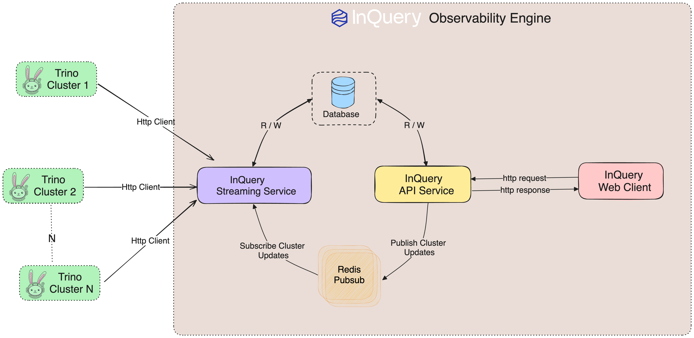

# Inquery Observability Engine

## Overview
This documentation provides an overview of the architecture and workflow within the Inquery Observability Engine, detailing the interaction between various internal components, including Trino Clusters, Inquery Streaming Service, Database, Inquery API Service, Inquery Web Client, and Redis Pub/Sub.

## Components
1. Trino Clusters

    Single or Multiple Trino clusters are hosted, each with a specific host and port.

1. Inquery Streaming Service

    The Inquery Streaming Service pulls event data from the Trino clusters using Trino's HTTP client. The data is formatted and stored in a database. Updates are published to a Redis Pub/Sub setup.

3. Database

    Stores the formatted data retrieved by the Inquery Streaming Service from Trino clusters.

4. Inquery API Service

    This service provides data stored in the database to the Inquery Web Client and subscribes to updates from the Redis Pub/Sub setup.

5. Inquery Web Client

    Provides a dashboard to Add / Update / Delete cluster, Displays a list of clusters and detailed information about each cluster, including metrics such as cluster capacity, usage, latency, failure rate, active workers, and active queries.

6. Redis Pub/Sub

    Connects the Inquery Streaming Service and the Inquery API Service, used to publish/subscribe to updates on any Trino cluster.

## Data Flow Diagram

    

The following diagram illustrates the data flow within the Inquery system:

- Trino Clusters (Multiple Instances):
    - Each Trino cluster is hosted with a specific host and port.

- Inquery Streaming Service:
    - Pulls event data from multiple Trino clusters using Trino's HTTP client
    - Formats and stores the data in a database.
    - Subscribes updates to the Redis Pub/Sub setup.

- Database
    - Stores the formatted data retrieved by the Inquery Streaming Service.

- Inquery API Service
    - Provides data stored in the database to the Inquery Web Client.
    - Publishes to updates from the Redis Pub/Sub setup.

- Inquery Web Client
    - Displays a list of clusters and detailed information about each cluster
    - Shows metrics such as cluster capacity, memory usage, cpu usage, latency, failure rates, active workers, and active queries.
    - Provides functionality to Add new trino cluster, Update or Delete existing trino cluster.

- Redis Pub/Sub
    - Connects the Inquery Streaming Service and the Inquery API Service.
    - Used to publish/subscribe to updates on any Trino cluster.